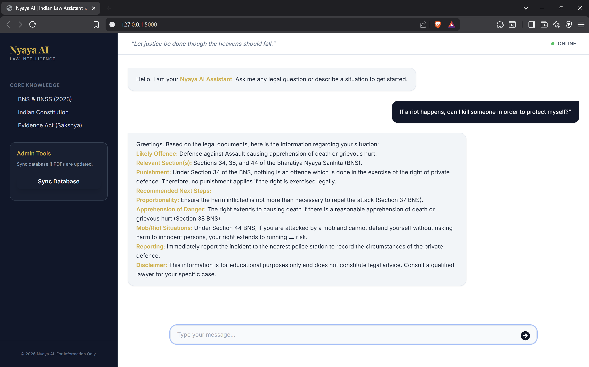

# Nyaya AI | Indian Law Assistant ⚖️🇮🇳

Nyaya AI is a high-performance legal assistant backend powered by **Retrieval-Augmented Generation (RAG)**. It provides accurate legal information based on official Indian legal documents, including the BNS, BNSS, Sakshya, and the Constitution of India.

Designed as a robust Flask backend, it is ready to serve as the intelligence layer for Android applications or web interfaces.



---

## 🚀 Key Features
- **RAG-Powered Intelligence**: Answers queries using official legal codices.
- **Situational Analysis**: Specifically handles legal situations (e.g., harassment, physical assault) with empathetic greetings and structured legal advice.
- **Multilingual Support**: Supports queries in English, Hindi, and Hinglish.
- **Android Ready**: Clean API endpoints (`/chat`) for mobile integration.
- **Local Network Access**: Built-in support for same-Wi-Fi access for team testing.

---

## 🛠️ Tech Stack
- **Backend**: Flask, Flask-CORS
- **AI Framework**: LangChain (0.3.x)
- **LLM**: Google Gemini (Gemini-Flash)
- **Embeddings**: HuggingFace Multilingual (Local)
- **Vector DB**: ChromaDB

---

## ⚙️ Setup Instructions

### 1. Prerequisites
- Python 3.11+
- A Google API Key (Gemini)

### 2. Installation
```bash
# Create and activate virtual environment
python -m venv .venv
source .venv/bin/activate  # On Windows: .venv\Scripts\activate

# Install dependencies
pip install -r requirements.txt
```

### 3. Configuration
Create a `.env` file in the root directory:
```env
GOOGLE_API_KEY=your_gemini_api_key_here
PORT=5000
```

### 4. Data Preparation
Place your legal PDF files in the `data/` folder. The system is pre-configured for:
- `bns.pdf`
- `bnss.pdf`
- `sakshya.pdf`
- `the_constitution_of_india.pdf`

---

## 🌐 Running & Wi-Fi Access

### Start the Server
```bash
python app.py
```

### Accessing via Wi-Fi (for Android APK/Friends)
To allow other devices on your Wi-Fi to connect:
1. Find your Local IP (Run `ipconfig` on Windows or `ifconfig` on Linux).
2. Your friend/APK can then access the server at:
   - **Web Interface**: `http://<YOUR_IP>:5000`
   - **Chat API**: `POST http://<YOUR_IP>:5000/chat`

---

## 📡 API Endpoints

### 1. Chat
- **URL**: `/chat`
- **Method**: `POST`
- **Body**: `{"message": "What are my basic rights?"}`
- **Response**: `{"response": "... legal answer ..."}`

### 2. Re-index Documents
- **URL**: `/reindex`
- **Method**: `POST`
- **Description**: Re-scans the `data/` folder and rebuilds the vector database.

---

## ⚖️ Disclaimer
Nyaya AI is for **informational purposes only**. It does not constitute official legal advice. Always consult with a qualified legal professional for serious matters.
